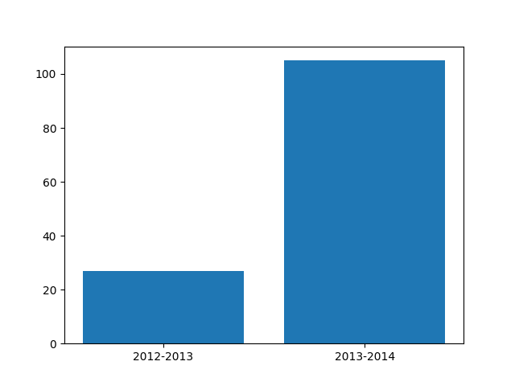

# Entrega 3 #
***
**IMPORTANTE:** El acceso a los elementos de toda variable o parámetro de tipo `Vivienda`, debe hacerse con el operador punto, es decir, `vivienda.fecha_construccion` en lugar de `vivienda[0]`. 

**IGNORAR ESTE AVISO, CONLLEVARÁ LA CALIFICACIÓN DE NO APTO**
***
Además de lo anterior, existen las siguientes restricciones:
***
- La nota mínima de esta entrega debe ser de **3.75**. 
- Se deben implementar todos los ejercicios con independencia de si funcionan correctamente o no.
- El proyecto debe estar exento de errores sintácticos.
- No se permitirá código ilegible y con un tamaño desmesurado.
- No se pueden utilizar elementos no contemplados en la asignatura. Si usted quiere usar alguno,
  debe preguntar al profesor.
***
**IGNORAR CUALQUIERA DE LAS RESTRICCIONES ANTERIORES, CONLLEVARÁ LA CALIFICACIÓN DE NO APTO**

Implemente los siguientes ejercicios:

```
def localidades_mayor_precio_medio(viviendas, n=5):
    """Devuelve las n localidades con el precio medio más alto (no confundir con el precio medio por metro cuadrado).
       El resultado estará ordenado de mayor a menor precio medio.
    Args:
        viviendas (list[Vivienda]): Lista de viviendas.
        n (int, optional): Número de localidades. Defaults to 5.

    Returns:
        list[str]: Lista de localidades.
    """
    pass

meses=["Enero", "Febrero", "Marzo", "Abril", "Mayo", "Junio", "Julio", "Agosto", \
                        "Septiembre", "Octubre", "Noviembre", "Diciembre"]

def porcentaje(viviendas, n_baños=2, año_ini=None, año_fin=None):
    """Devuelve el porcentaje de viviendas construidas en cada mes, con al menos n_baños, y cuyo año de construcción
    está comprendido entre año_ini y año_fin (ambos excluidos). Si año_ini es None, se tendrán en cuenta todas las viviendas construidas antes de año_fin con al menos n_baños. Si año_fin es None, se tendrán en cuenta todas las viviendas construidas después de año_ini con al menos n_baños. Si año_ini y año_fin son None, se tendrán en cuenta todas las viviendas con al menos n_baños.

    Args:
        viviendas (list[Vivienda]): Lista de viviendas.
        n_baños (int, optional): Número de baños. Defaults to 2.
        año_ini (int, optional): Año inicial. Defaults to None.
        año_fin (int, optional): Año final. Defaults to None.

    Returns:
        dict[str, float]: Diccionario que relaciona cada mes (de la lista 'meses') con el porcentaje de viviendas 
        construidas en ese mes respecto al total de viviendas que cumplen las condiciones.
    """
    pass

def eleva_excepcion():
    raise ValueError("Parámetro incorrecto")

def grafica_num_viviendas_por_rango(viviendas, años=[2015,2016,2017]) :
    """dibuja un gráfico de barras con el número de viviendas construidas en cada rango de años. 
    Los rangos de años, se obtienen de la lista 'años' que puede tener un tamaño cualquiera. Por ejemplo, si años=[2015,2016,2017], se mostrará el número de viviendas construidas entre 2015 incluido y 2016 excluido, y entre 2016 incluido, y 2017 excluido. Si los años de la lista 'años' no son consecutivos, se debe llamar a la función eleva_excepcion() que se proporciona.

    Args:
        viviendas (list[Vivienda]): Lista de viviendas.
        años (list[int], optional): Lista de años. Defaults to [2015,2016,2017].
    .
    """
    pass

def localidad_mas_construida_por_año(viviendas):
    """Devuelve un diccionario que relaciona cada año con la localidad en la que se construyeron más viviendas en ese año.
    Args:
        viviendas (list[Vivienda]): Lista de viviendas.

    Returns:
        dict[int, str]: Diccionario que relaciona cada año con la localidad en la que se construyeron más viviendas.
    """
    pass


def maximos_minimos(viviendas, expr, max_min=max):
    """Devuelve el máximo o el mínimo y empatados si los hubiera, en base a alguna característica de la vivienda que también se le pasa como parámetro en forma de expresión lambda. Si max_min no es la función max o min, se debe llamar a la función eleva_excepcion()

    Args:
        viviendas (list[Vivienda]): Lista de viviendas.
        expr (Callable[[Vivienda], Any]): Expresión lambda que recibe una vivienda y devuelve una característica de la vivienda.
        max_min (Callable[[list[Vivienda]], Vivienda]): max o min. Defaults to max.
    Returns:
        list[Vivienda]: Lista de viviendas.
    """
    pass
```
A continuación, se muestra la salida esperada de las funciones implementadas:
```
Ej. 1. probando las 10 localidades_mayor_precio_medio:
['Dianefort', 'Markberg', 'New Richard', 'Gregoryshire', 'Simsfort', 'West Kimberly', 'South Coryshire', 'Port Nathan', 'West Maryberg', 'Port Travismouth']
#############################################################################################################
Ej. 2.1. probando porcentaje entre 2013 y 2015:
{'Marzo': 6.578947368421052, 'Mayo': 17.105263157894736, 'Enero': 9.210526315789473, 'Febrero': 15.789473684210526, 'Septiembre': 7.894736842105263, 'Agosto': 10.526315789473683, 'Julio': 6.578947368421052, 'Noviembre': 7.894736842105263, 'Octubre': 3.9473684210526314, 'Abril': 2.631578947368421, 'Diciembre': 6.578947368421052, 'Junio': 5.263157894736842}

Ej. 2.2. probando porcentaje a partir de 2013:
{'Febrero': 8.609271523178808, 'Junio': 6.788079470198675, 'Julio': 9.271523178807946, 'Enero': 8.609271523178808, 'Septiembre': 8.940397350993377, 'Marzo': 9.933774834437086, 'Diciembre': 8.940397350993377, 'Octubre': 5.4635761589403975, 'Agosto': 8.609271523178808, 'Abril': 7.9470198675496695, 'Mayo': 10.099337748344372, 'Noviembre': 6.788079470198675}

Ej. 2.3. probando porcentaje antes de 2015:
{'Julio': 6.097560975609756, 'Febrero': 10.975609756097562, 'Junio': 7.317073170731707, 'Abril': 4.878048780487805, 'Marzo': 5.487804878048781, 'Mayo': 8.536585365853659, 'Octubre': 9.146341463414634, 'Enero': 6.097560975609756, 'Diciembre': 11.585365853658537, 'Septiembre': 10.365853658536585, 'Agosto': 8.536585365853659, 'Noviembre': 10.975609756097562}

Ej. 2.4. probando porcentaje en todos los años:
{'Febrero': 8.38150289017341, 'Junio': 7.08092485549133, 'Julio': 8.815028901734104, 'Enero': 7.947976878612717, 'Septiembre': 9.393063583815028, 'Marzo': 9.248554913294797, 'Diciembre': 9.826589595375722, 'Octubre': 6.502890173410404, 'Abril': 7.803468208092486, 'Agosto': 8.38150289017341, 'Mayo': 8.959537572254336, 'Noviembre': 7.658959537572255}
#############################################################################################################

Ej. 3. probando grafica_num_viviendas_por_rango:
```


```
#############################################################################################################

Ej. 4. probando localidad_mas_construida_por_año:
{2019: 'Michaelshire', 2015: 'Michaelfort', 2021: 'Knightview', 2018: 'Mistyville', 2020: 'Shawnfurt', 2016: 'Jordanfurt', 2017: 'North Anthony', 2013: 'Wardstad', 2014: 'East Kelly', 2012: 'Michellemouth'}
#############################################################################################################

Ej. 5. probando maximos_minimos. Mostrando las viviendas con menor superficie:
[Vivienda(fecha_construccion=datetime.date(2016, 4, 2), precio=507599, superficie=50, habitaciones=1, baños=3, localidad='Lake Stephanie', 
vendido=True), Vivienda(fecha_construccion=datetime.date(2014, 5, 2), precio=469397, superficie=50, habitaciones=5, baños=3, localidad='South Aliciaport', vendido=False)]
```	


